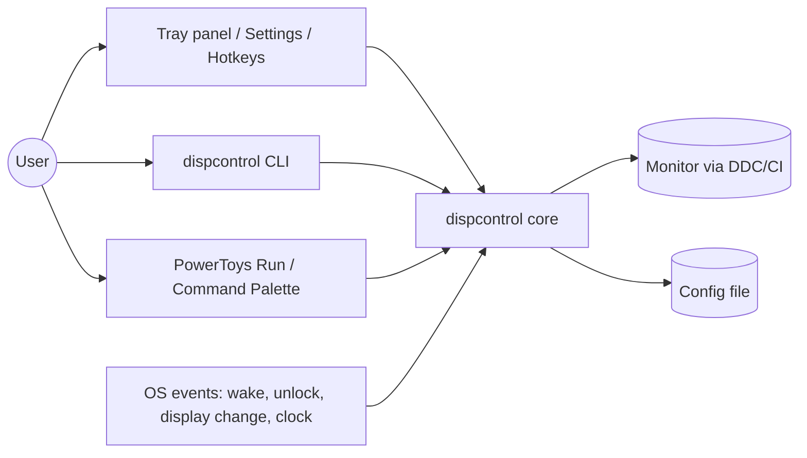
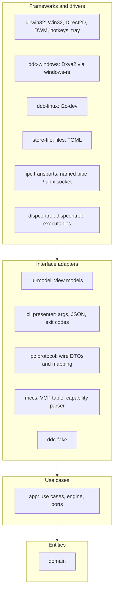
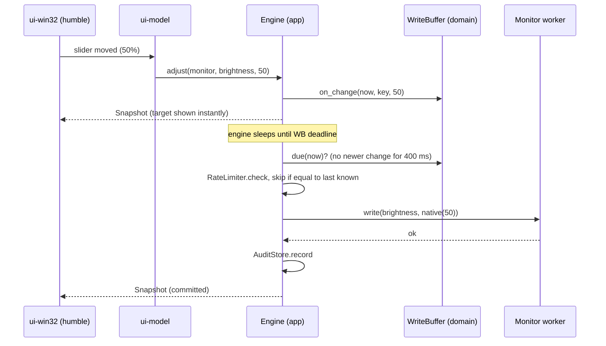
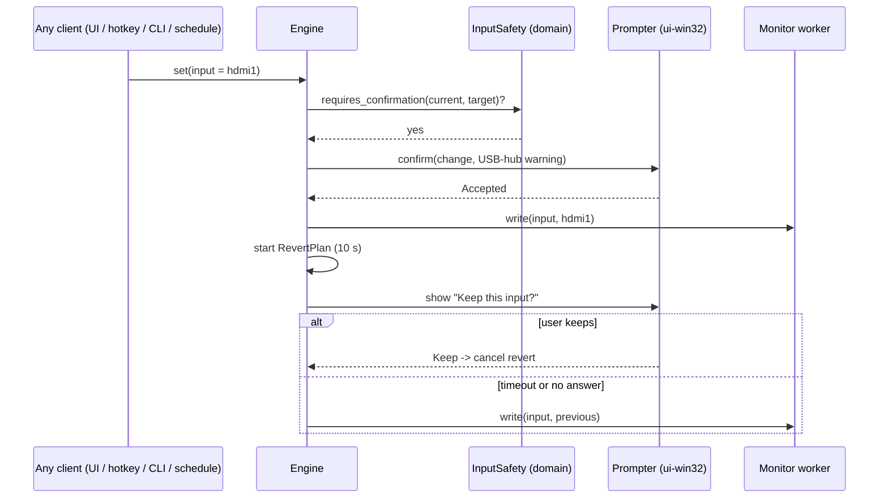

# dispcontrol: Architecture

Status: Architecture v0.3. Derived from [PRD.md](./PRD.md) and [SPEC.md](./SPEC.md). Describes *how* the product is built. Requirement IDs (`SPEC-...`) refer to the spec.

## 1. Purpose and scope
This document defines the structure of dispcontrol: layers, modules (Rust crates), the interfaces between them, the runtime model, and the platform-specific parts. It follows Clean Architecture (section 2), and section 3 explains how each guideline is applied here.

Non-goals: UI pixel design (see `mockups/`), exact data formats (a later "data formats" appendix of the spec), and release process details.

## 2. Clean Architecture guidelines (the rules we follow)
These are the guidelines from Robert C. Martin's *Clean Architecture*, stated as rules for this project.

| # | Guideline | Statement |
|---|---|---|
| G1 | **The Dependency Rule** | Source-code dependencies point only inward. Inner layers know nothing about outer layers: no names, types, or functions from an outer layer appear in an inner one. |
| G2 | **Four layers** | Entities (enterprise rules) -> Use cases (application rules) -> Interface adapters -> Frameworks and drivers (outermost). |
| G3 | **Entities** | Hold the most general, stable business rules. Plain data and pure logic. Least likely to change when anything external changes. |
| G4 | **Use cases** | Hold application-specific rules and orchestrate entities. They define the interfaces (ports) they need from the outside world. |
| G5 | **Interface adapters** | Convert data between the form convenient for use cases/entities and the form convenient for external agencies (controllers, presenters, gateways). |
| G6 | **Frameworks and drivers** | Glue code for the OS, GUI toolkit, file system, devices. Details, kept on the outside. |
| G7 | **Dependency inversion at boundaries** | When control flow must cross a boundary outward, the inner layer declares an interface and the outer layer implements it. |
| G8 | **Simple data across boundaries** | Only simple, isolated data structures cross boundaries. Never pass framework objects or database rows inward. |
| G9 | **Independence** | The system is independent of frameworks, UI, database/storage and any external agency, and is testable without them. |
| G10 | **Details are plugins** | UI, storage, OS APIs and transport are replaceable plugins to the policy core. |
| G11 | **Humble Object** | At each boundary, split behavior into a testable part and a humble part that is hard to test and contains as little logic as possible (views, OS wrappers). |
| G12 | **Main is a plugin** | Wiring concrete implementations to abstractions happens in one outermost place (the composition root). |
| G13 | **Screaming architecture** | The structure shows what the system does (monitor control, presets, schedule), not which framework it uses. |
| G14 | **Component principles** | Cohesion: REP (reuse/release equivalence), CCP (common closure), CRP (common reuse). Coupling: ADP (acyclic dependencies), SDP (depend toward stability), SAP (stable abstractions). |
| G15 | **Boundaries are enforced, not hoped for** | The dependency rule must be checkable by tooling, not only by review. |
| G16 | **Test pyramid** | Prefer many fast, deterministic tests of inner policies, fewer adapter/contract integration tests, and only a small number of end-to-end or real-hardware checks. Keep UI and OS tests at the narrowest practical seams. |

## 3. How this architecture follows the guidelines

| Guideline | How dispcontrol applies it |
|---|---|
| G1 Dependency Rule | The Rust workspace is split into crates whose `Cargo.toml` dependencies only point inward (section 5). A crate cannot import something it does not depend on, so a violation fails to compile. |
| G2 Four layers | Entities = `domain` crate. Use cases = `app` crate. Interface adapters = `adapters/*`, `ui-model`, CLI presenter, IPC mapping. Frameworks and drivers = `windows-rs`, Dxva2, Win32/Direct2D, i2c, filesystem, `toml`. |
| G3 Entities | `domain` contains controls, normalized values, presets, schedule rules and their evaluation, write-buffer and rate-limit rules, input-safety policy. All pure Rust, no I/O, no threads, no clock access (time is passed in). |
| G4 Use cases | `app` contains the use cases (set/adjust a control, apply/capture preset, schedule, confirm-and-revert input change, audit) and declares ports such as `MonitorBackend`, `ConfigRepository`, `Clock`, `Prompter`. |
| G5 Interface adapters | CLI argument parsing and JSON/exit-code presentation, IPC wire encoding, TOML config mapping, `ui-model` view models, and the per-OS monitor adapters that translate DDC/CI into domain types. |
| G6 Frameworks and drivers | Win32 message loop, Direct2D/DWM drawing, Dxva2 calls, named pipes, registry autostart, hotkey registration. All `unsafe` code lives only here. |
| G7 Dependency inversion | Use cases call ports (traits) they define; adapters implement them. Example: `app` defines `MonitorBackend`; `ddc-windows` and `ddc-linux` implement it; `app` never names Dxva2. |
| G8 Simple data | Ports exchange plain structs/enums (`MonitorId`, `ControlKey`, `NativeValue`, `Capabilities`, `Snapshot`). No `HMONITOR`, `HWND`, TOML tables or JSON values cross inward. |
| G9 Independence | Framework independence: the core builds and tests with no `windows` crate. UI independence: CLI, tray UI, plugins and tests all drive the same `Api`. Storage independence: config is behind `ConfigRepository`. Hardware independence: tests use `ddc-fake`. |
| G10 Plugins | New GPU paths (Intel IGCL, NVAPI), laptop panel control, software dimming, a Linux tray, or macOS are new adapters; the core does not change (this is how the PRD's future features fit). |
| G11 Humble Object | Window procedures and the DDC FFI calls are humble: they only translate and forward. Behavior lives in `ui-model` (view models, formatting, enabled/disabled logic) and in `app`, both unit-testable. |
| G12 Main is a plugin | Two small executables (`dispcontrol` CLI, `dispcontrold` tray app) are the composition roots: they construct adapters, inject them into the engine, and start it. Nothing else instantiates concrete adapters. |
| G13 Screaming | Crate and module names are `monitor`, `control`, `preset`, `schedule`, `write_policy`, `input_safety`, not `windows`, `serde`, `ui`. |
| G14 Component principles | See section 5.3. |
| G15 Enforcement | CI checks the crate graph (section 12) and forbids `unsafe` and OS/framework crates in `domain` and `app`. |
| G16 Test pyramid | Domain policy is validated with fast unit tests; app use cases with fakes; adapters with focused contract/integration tests; only a small smoke/acceptance layer uses the whole process or real hardware (section 11). |

## 4. System context

All entry points reach the same core through one interface (`Api`, section 6.3), so behavior (write protection, input safety, schedule) is identical regardless of how a change is requested (SPEC-INT-3).

## 5. Layers and crates

### 5.1 Layer diagram

Arrows mean "depends on". Nothing points upward.

### 5.2 Repository layout
```
dispcontrol/
  crates/
    domain/            entities and pure rules                         (layer 1)
    app/               use cases, engine, port traits                  (layer 2)
    mccs/              DDC/CI standard: VCP codes, capability parser   (layer 3)
    ui-model/          view models for panel and settings              (layer 3)
    ipc/               wire protocol, client and server mapping        (layer 3)
    cli/               argument parsing and presentation               (layer 3)
    ddc-fake/          simulated monitors for tests and demos          (layer 3)
    ddc-windows/       MonitorBackend over Dxva2                       (layer 4)
    ddc-linux/         MonitorBackend over /dev/i2c-*                  (layer 4)
    store-file/        ConfigRepository, QuirkRepository, caches       (layer 4)
    ui-win32/          tray, panel, settings, OSD, hotkeys, prompts    (layer 4)
    bin-cli/           `dispcontrol` executable (composition root)     (layer 4)
    bin-daemon/        `dispcontrold` executable (composition root)    (layer 4)
  integrations/
    powertoys-run/     C# plugin (thin pipe client)
    cmdpal/            C# Command Palette extension (thin pipe client)
  quirks/              per-model quirk profiles (data)
  mockups/  docs/
```

### 5.3 Dependency rules and component principles
Allowed dependencies (everything else is forbidden):

| Crate | May depend on |
|---|---|
| `domain` | `std` only (plus tiny pure utility crates, e.g. a `thiserror`-style macro) |
| `app` | `domain`, `std`, the `log` facade |
| `mccs`, `ui-model`, `ipc`, `cli`, `ddc-fake` | `domain`, `app`; `ipc` and `cli` may use `serde_json`/`clap`-class parsing crates; `cli` uses `ipc` (it is a daemon client). Exception: `ipc` uses `windows` for its Windows-only named-pipe transport, until that moves into its own adapter crate. |
| `ddc-windows`, `ddc-linux`, `store-file`, `ui-win32` | `domain`, `app`, `mccs`/`ui-model` as needed, and their OS or format crates (`windows`, `toml`, ...) |
| `bin-*` | anything (composition roots) |

How the component principles are met:
- **REP/CCP:** things that change together live together: all schedule logic changes in `domain::schedule` and `app::schedule`; all Dxva2 changes in `ddc-windows`.
- **CRP:** `ui-model` is separate from `ui-win32` so a future Linux UI reuses the view models without pulling Win32 code.
- **ADP:** the crate graph is a DAG; cargo rejects cycles, and CI additionally checks layering (section 12).
- **SDP/SAP:** stable crates (`domain`) are the most depended upon and are mostly abstract rules plus data; volatile crates (`ui-win32`, `ddc-*`) are depended upon by no one except the executables.

## 6. Entities and use cases

### 6.1 Domain (`domain`)
Pure data and rules; time and randomness are always passed in.
- **Identifiers and values:** `MonitorId` (from EDID manufacturer + model + serial, with an "unstable" flag when the serial is missing), `ControlKey` (`Brightness`, `Contrast`, `Volume`, `Input`, `Power`, `ColorPreset`, `GainRed/Green/Blue`), `Percent` (0-100 newtype), `NativeRange {min,max}`, `EnumKey` (canonical key such as `hdmi1`, `usbc`, or `raw-<code>`).
- **Normalization (SPEC-CTL-3):** `NativeRange::to_percent` / `from_percent`, deterministic and round-trip safe.
- **Capabilities:** per control either `Level(NativeRange)` or `Choice(Vec<(EnumKey, NativeValue)>)`; plus a `source` (`Reported` or `Probed`) and an applied-quirk marker.
- **Quirk profile:** plain data type (capability overrides, timing, retry hints) (SPEC-QRK).
- **Preset and entries:** `{monitor, control, value}` using normalized values and `EnumKey`s; `apply_order` (SPEC-PRE-4) and `diff(preset, current_state)` returning only entries that must be written (SPEC-PRE-3, SPEC-WR-4).
- **Schedule:** `Rule {time, days, preset, enabled}`; pure functions `next_trigger(now_local, rules)` and `most_recent_missed(now_local, rules, last_applied)` (SPEC-SCH-2/3/6/7).
- **Write policy (SPEC-WR):** `WriteBuffer` (per monitor+control target, quiet period, "latest wins"), `RateLimiter` (1/s and 30/min), `LivePreviewThrottle` (max 4/s). They are state machines taking `now: Instant` as an argument, so tests use a fake time.
- **Input safety policy (SPEC-IN):** `requires_confirmation(current, target, settings)` and `RevertPlan {previous, deadline}`.
- **Settings:** validated value types (write delay 150-2000 ms, revert 0 or 5-60 s, steps, etc.).
- **Errors:** typed enums (`NotSupported`, `OutOfRange`, `NotFound`, ...); no strings as control flow.

### 6.2 Application (`app`)
Use cases orchestrate entities through ports. Each use case is a small unit with injected ports.

| Use case | Key behavior | Spec |
|---|---|---|
| `DiscoverMonitors` / `RefreshMonitors` | Enumerate, open sessions, discover capabilities (cached), apply quirk profile, build the monitor registry. Never writes. | SPEC-MON, SPEC-CTL-2, SPEC-QRK |
| `ReadControl` | Read on demand through the monitor worker; map native to normalized. | SPEC-WR-8 |
| `AdjustControl` (interactive) | Update in-memory target immediately and publish a snapshot; schedule commit via `WriteBuffer`. | SPEC-WR-1..3, 9 |
| `SetControl` (explicit) | Commit now (still skipping equal values and honoring rate limits). Used by CLI and integrations. | SPEC-WR-4, 6, 7 |
| `ChangeInput` | Run `InputSafety`: ask the user via `Prompter` if needed, commit, start revert timer, restore on timeout, cancel on "Keep". | SPEC-IN |
| `ApplyPreset` / `CapturePreset` / preset CRUD | Use `diff` and `apply_order`; one confirmation for the whole preset if it changes input; report per-entry results. | SPEC-PRE |
| `Schedule` (`Pause`, `Resume`, `Status`, `Reevaluate`) | Compute next trigger, handle missed rules and system events; pause state is persisted and never auto-resumes. | SPEC-SCH |
| `Hotkeys` | Turn configured bindings into `AdjustControl` / `ApplyPreset` / etc. calls; report registration failures. | SPEC-HK |
| `Audit` | Count commits per monitor and control when enabled. | SPEC-WR-10 |
| `Settings` | Validate, persist (atomic), publish changes. | SPEC-DAT |

### 6.3 Ports
**Inbound (driving) port:** `Api`: the one interface all clients use.
```text
trait Api {
  list_monitors() -> Vec<MonitorView>          read(monitor, control) -> Value
  adjust(monitor, control, Value)               // interactive, buffered
  set(monitor, control, Value, opts)            // explicit, immediate
  presets: list / save / capture / delete / reorder / apply(name)
  schedule: pause / resume / status / rules CRUD
  settings: get / update          audit: get / reset
  subscribe() -> Events           // Snapshot updates, results, prompts
}
```
Two implementations exist: `Engine` (in-process, hosted only by `dispcontrold` and tests) and `IpcClient` (in `ipc`, forwards to a running `dispcontrold`). The CLI and plugins only ever use `IpcClient` and never talk to monitors (SPEC-CLI-2).

**Outbound (driven) ports** (declared in `app`, implemented in outer layers):

| Port | Responsibility | Implemented by |
|---|---|---|
| `MonitorBackend` / `MonitorSession` | Enumerate monitors; per monitor: capabilities, read, write, in domain terms (`ControlKey`, `NativeValue`). No protocol codes cross this port. | `ddc-windows`, `ddc-linux`, `ddc-fake` |
| `ConfigRepository` | Load/save settings, presets, rules, input aliases, schedule pause state. | `store-file` |
| `QuirkRepository`, `CapabilityCache` | Load quirk profiles; cache discovered capabilities by `MonitorId`. | `store-file` |
| `Clock` | Monotonic time and local wall-clock time. | `bin-*` (system clock), tests (fake) |
| `Prompter` | Ask for input-change confirmation and the "Keep this input?" revert prompt; returns the decision as an event. | `ui-win32`, CLI (console prompt/`--yes`) |
| `Notifier` | On-screen indicator, error toasts, tray tooltip/state. | `ui-win32` |
| `HotkeyRegistrar` | Register bindings and report conflicts. | `ui-win32` |
| `AuditStore` | Persist commit counters. | `store-file` |
| `Autostart` | Enable or disable start with Windows. | `ui-win32` (registry) |

System events (wake, unlock, display change, clock/time zone change) are not a port: drivers push them in as `SystemEvent` values via `Engine::notify` (inbound).

### 6.4 Why DDC/CI is not in the core
The core speaks in `ControlKey` and `NativeValue`. VCP codes, capability strings and Dxva2 handles live in `mccs` and the `ddc-*` adapters (SPEC-CTL-2 and SPEC-QRK are satisfied by adapter returning `Capabilities`, with `app` merging quirk overrides). Because of this, later transports (laptop panel via WMI, software dimming overlay, vendor GPU APIs, USB-HID monitor control) are new `MonitorBackend`s, with no core change.

## 7. Runtime model
- **No async runtime.** Plain OS threads and channels (`std`), to keep binary size and idle cost small.
- **Threads in `dispcontrold`:**
  1. **UI thread**: Win32 message loop; owns tray, panel, settings, OSD, dialogs; registers hotkeys; receives system messages (`WM_POWERBROADCAST`, `WM_WTSSESSION_CHANGE`, `WM_DISPLAYCHANGE`, `WM_TIMECHANGE`).
  2. **Engine thread**: an actor that owns all mutable state (monitor registry, write buffers, schedule, revert timers). It blocks on a command channel with a timeout equal to the nearest deadline (debounce, rate limit release, next rule, revert). With no deadline it blocks forever: idle CPU is 0 (SPEC-NFR-1).
  3. **One I/O worker per monitor**: serializes DDC calls (DDC/CI is not safe to run concurrently per monitor).
  4. **IPC listener thread**: accepts clients and forwards requests to the engine.
- **Timeouts (SPEC-MON-4):** a DDC call can block inside the driver and cannot be cancelled. The engine waits on the worker with a timeout (default 2 s, up to 3 attempts with backoff). On timeout it marks the monitor "not responding" and replaces the worker; the stuck thread is abandoned and exits when the call returns. Other monitors, the UI and hotkeys are never blocked.
- **State publication:** the engine publishes immutable `Snapshot`s. The UI thread receives them through a queue plus a custom window message, so UI code never locks engine state.
- **Backpressure:** hotkey auto-repeat and slider drags only update the in-memory target; at most one commit per control is queued.
- **Memory (SPEC-NFR-1):** windows and GPU resources (render targets, DirectWrite objects) are created when a window is shown and released when it is hidden. The settings window is created lazily. Idle residence is tray icon + engine + workers.

## 8. Key flows

### 8.1 Slider drag (write protection)

Result: exactly one write per adjustment (SPEC-WR-2/3/4). Live preview, when enabled, makes `WriteBuffer` also emit throttled intermediate commits (SPEC-WR-9).

### 8.2 Input change with confirmation and revert

Presets and schedule rules that contain an input change go through the same path, with one confirmation for the whole preset (SPEC-IN-6, SPEC-SCH-8). `--yes`/`--no-revert` map to options on `set`.

### 8.3 Schedule and system events
`Schedule` asks `domain::schedule::next_trigger` for the next deadline and gives it to the engine; the engine wakes only then. On `SystemEvent::{Resume, Unlock, DisplayChange, TimeChanged}` it calls `Reevaluate`, which refreshes monitors (reads only), recomputes the deadline and applies the most recent missed rule once (SPEC-SCH-3/7). Manual changes do not touch rules, so SPEC-SCH-4 holds by construction. Pause state is saved through `ConfigRepository` and never cleared automatically.

### 8.4 CLI
```text
dispcontrol set brightness 40
  -> cli parses args into an Api call
  -> IpcClient forwards to dispcontrold (shared buffers, limits, confirmation)
  -> daemon not running (pipe/socket connect fails): no side effects, error "app not running", exit code 7
  -> cli presenter prints text or JSON and maps errors to exit codes (SPEC section 10)
```

### 8.5 Hotkey
`WM_HOTKEY` (UI thread, humble) -> `Hotkeys` use case resolves the action -> `adjust`/`apply_preset`/etc. on the engine -> `Notifier` shows the on-screen indicator after the engine publishes the new value.

## 9. Interface adapters and drivers

### 9.1 Monitor backends
**`mccs` (shared by DDC adapters):** VCP code table (brightness 0x10, contrast 0x12, color preset 0x14, gains 0x16/0x18/0x1A, input 0x60, volume 0x62, power 0xD6), canonical enum tables for inputs and color presets, and a tolerant capability-string parser that survives malformed strings. When the string is missing or invalid, discovery probes each known control with a read and marks `source = Probed`.

**`ddc-windows`:** `windows` crate over the monitor-configuration API (`GetPhysicalMonitorsFromHMONITOR`, `GetVCPFeatureAndVCPFeatureReply`, `SetVCPFeature`, capability-string functions). `MonitorId` comes from EDID, found by mapping the HMONITOR through `EnumDisplayDevices` to the device registry key. Capability retrieval can take seconds, so it runs once per monitor in the background and is cached (`CapabilityCache`), keeping refresh after wake within SPEC-MON-3. **Open:** whether this path works on Intel Iris Xe with a USB-C (DP Alt Mode) connection (see section 14). Fallback path if not: a second adapter using Intel's vendor API behind the same `MonitorBackend`.

**`ddc-linux`:** ddcutil-compatible access through `/dev/i2c-*` (requires the `i2c-dev` module and group permission). Decided: it uses `ddcutil` (invoked as a subprocess behind the same `MonitorBackend` port; the package is a declared dependency of the Ubuntu package). A native implementation is a possible later replacement without core changes.

**`ddc-fake`:** configurable simulated monitors (capabilities, scripted read/write failures, disconnects; latency and hangs are not simulated yet) plus in-memory doubles of the other ports (settings, presets with an export/import round trip, a scripted input prompter, a manual clock) and a `Harness` that wires them into a `MonitorService`. Used by the `app`, `ipc`, `cli` and `ui-model` tests and for demos.

### 9.2 Persistence (`store-file`)
- Single human-editable **TOML** file in `%APPDATA%\dispcontrol\config.toml` (`~/.config/dispcontrol/config.toml` on Linux); a `config.toml` beside the executable switches to portable mode (SPEC-DAT-1).
- Config DTOs (with `serde`) live only in this crate and are mapped to domain types; the domain has no `serde` dependency (G8, G9).
- Writes are atomic (write temp, then replace) and happen only when settings change (SPEC-DAT-3). On parse errors, the broken section falls back to defaults, a `.bak` copy is kept, and the error is reported with line info (SPEC-DAT-2). A `version` field supports migration (SPEC-DAT-4).
- Quirk profiles are TOML data files: shipped set embedded in the binary plus a user directory that overrides (SPEC-QRK-2). The capability cache and audit counters are separate small files in the local data directory, so the config file stays hand-editable.

### 9.3 IPC (`ipc`)
- **Transport:** named pipe `\\.\pipe\dispcontrol-<user>` on Windows, Unix socket in `$XDG_RUNTIME_DIR` on Linux. Access limited to the current user (pipe ACL / socket mode 0600). No network listener at all (SPEC-NFR-2).
- **Protocol:** length-prefixed JSON messages, versioned, one request/response per call plus an event stream for `subscribe`. The wire DTOs live in `ipc` and are mapped to `Api` calls; the protocol is documented because the C# plugins implement it directly.
- **Single instance:** a named mutex (Windows) or lock file (Linux) in `bin-daemon`. A second launch forwards its request over IPC and exits.

### 9.4 CLI (`cli`, `bin-cli`)
Presenter and controller for the command line: parses arguments, calls `Api`, renders text or the single JSON object (`--json`), and maps `AppError` to the documented exit codes. It contains no business rules. `bin-cli` is a console-subsystem executable.

### 9.5 Windows UI (`ui-win32`, `ui-model`)
- **Split (G11):** `ui-model` holds view models (what to show, formatting, enabled states, input names with aliases, schedule status text) and is fully unit-tested. `ui-win32` is the humble view: it draws the view model and forwards user input as `Api` calls.
- **Technology:** `windows-rs` calling Win32 directly; **Direct2D + DirectWrite** for drawing; **DWM** for the Windows 11 look (Mica/Acrylic backdrop, rounded corners, immersive dark mode); follows the system theme. No UI framework or WebView.
- **Windows:** transient tray panel (closes on focus loss and Esc), settings window (lazy, minimize or close hides it, no taskbar button, SPEC-UI-8), on-screen indicator (small layered window), confirmation and "Keep this input?" dialogs. Tray icon handling follows SPEC-UI-9; the app never tries to pin the icon outside the overflow.
- **Hotkeys:** `RegisterHotKey`; failures are reported through `HotkeyRegistrar`.
- **Autostart:** per-user registry Run key (`Autostart` port).
- **Accessibility (SPEC-UI-7):** custom-drawn controls must expose UI Automation providers. **Open:** see risks.
- `bin-daemon` is a GUI-subsystem executable (no console window).

### 9.6 PowerToys integrations (`integrations/`)
Thin C# clients of the IPC protocol (they hold no rules): PowerToys Run plugin (keyword `dc`) and a Command Palette extension. If the daemon is not running they show an "app not running" error and do nothing else. They cannot bypass input confirmation or write protection because those are enforced in the engine (SPEC-INT-3).

### 9.7 Ubuntu (GNOME on Wayland)
Reuses `domain`, `app`, `ipc`, `cli`, `store-file`. Adds `ddc-linux`. `dispcontrold` can run headless (scheduler + IPC) as a systemd user service. Hotkeys: XDG GlobalShortcuts portal where available, otherwise the user binds desktop shortcuts to CLI commands. Tray via StatusNotifierItem (needs the AppIndicator extension on GNOME); a Linux UI crate is a later plugin reusing `ui-model`.

## 10. Cross-cutting concerns
- **Errors:** typed in `domain`/`app`; mapped at the edges (exit codes, UI messages, JSON `error`). Errors never abort the engine; a failing monitor affects only that monitor (SPEC-NFR-4).
- **Logging:** the `log` facade is allowed everywhere; a sink is installed only when logging is enabled (default off), rotating 5 x 1 MB (SPEC-NFR-3). Logs contain monitor model and serial only.
- **Security and privacy:** no network, no telemetry, no admin rights. IPC restricted to the current user. `unsafe` only in `ddc-*`, `ui-win32`, and process-level helpers in `bin-*`, each wrapped in small safe functions.
- **Performance budgets:** idle 0% CPU, under 30 MB RSS, under 10 MB binary, under 300 ms to tray (SPEC-NFR-1). Measured in CI/perf scripts on the reference machine. Release profile: size-optimized, LTO, `panic = "abort"` where safe.
- **Time:** the domain never reads the clock; `Clock` supplies monotonic and local time. DST and clock changes are handled by re-deriving the next trigger on `TimeChanged` (SPEC-SCH-7).

## 11. Testing strategy: test pyramid

Every implementation change follows Clean Architecture and the test pyramid. Tests live beside the layer they validate; inner-layer tests must not require Windows, a display, disk, or a running daemon. Test doubles implement outward ports instead of pulling adapters inward.

| Pyramid layer | Relative amount | Target | Approach |
|---|---:|---|---|
| Unit (base) | Many | `domain`, pure `mccs` parsing, `ui-model` | Fast deterministic tests of pure rules and transformations. Pass time and randomness explicitly. No OS, filesystem, device, or process dependencies. |
| Use-case/component | Several | `app` | In-memory fake ports and controlled clocks/prompts. Verify observable calls and outcomes: no startup/exit writes, equal-value skip, input confirmation gate, buffering/rate limits, failures. |
| Adapter/contract integration | Few | `ddc-windows`, `store-file`, `ipc`, `cli` | Test the adapter against its public port/protocol with narrow fixtures or local fakes. Keep real-hardware tests opt-in and explicitly gated; never make ordinary CI write to a monitor. |
| System/UI/acceptance (tip) | Very few | composition roots and Windows UI | A small number of smoke checks exercise the assembled app. Hardware acceptance is a manual checklist on the reference display. Keep window procedures and OS calls as humble wrappers. |

Where tests live: `app` use-case tests are integration tests in `crates/app/tests/` (unit tests inside `app` cannot use `ddc-fake`, which links the non-test build of `app`); `ui-model` has unit tests for pure text/label rules in `src/text.rs` and view-model tests in `tests/`; `cli` tests run the real argument parsing against the daemon dispatcher through `run_with` and an in-process transport; `ipc` tests cover dispatch over fakes and real named-pipe round trips on private pipe names; `ui-win32` tests only its pure control-ID table (`modern/ids.rs`).

Do not duplicate the same assertion at every layer. Put each rule at the lowest layer that owns it, then add only the integration checks needed to prove boundaries are wired correctly. Default CI runs the unit, use-case, and safe adapter suites; it excludes physical monitor writes.

## 12. Enforcing the dependency rule (G15)
- **Cargo workspace crates** are the primary boundary (a missing dependency cannot be imported).
- **CI check:** `scripts/check_layers.py` parses `cargo metadata` and fails if any normal/build dependency violates the table in section 5.3 (for example `domain -> anything`, `app -> windows|toml|serde`), if a new crate has no rule, or if a crate listed below loses `#![forbid(unsafe_code)]`. Dev-dependencies are not checked.
- **Lints:** `#![forbid(unsafe_code)]` in `domain`, `app`, `mccs`, `ui-model`, `cli`, `ddc-fake`. The per-crate allowlist in the layering script bans OS/UI/format crates from inner crates; `cargo deny` (licences, advisories) is not set up yet.
- **Review rule:** new ports are added to `app`, never to adapters.

## 13. Build, packaging and CI
- One Cargo workspace; the two executables are built from `bin-cli` and `bin-daemon`; C# plugins build with `dotnet` in separate CI jobs.
- Targets: `x86_64-pc-windows-msvc` and `x86_64-unknown-linux-gnu`.
- CI (`.github/workflows/ci.yml`, `windows-latest`, MSVC toolchain): rustfmt, dependency-rule check, clippy, test, build. Size and startup budget checks are not automated yet. Local development on the reference machine uses the GNU toolchain (`x86_64-pc-windows-gnu`).
- Distribution: GitHub Releases (unsigned at first), then winget; `.deb`/AppImage for Ubuntu. MIT license.

## 14. Decisions

| # | Decision | Rationale |
|---|---|---|
| D1 | Rust | Small native binaries, no runtime, safe core, good Windows and Linux support. |
| D2 | Clean Architecture with crate-level boundaries | Enforced dependency rule, replaceable adapters, testable core (section 2, 3). |
| D3 | Threads and channels, no async runtime | Smaller binary, 0% idle, simple actor model; DDC is blocking anyway. |
| D4 | Engine as a single actor owning state | No locks in business logic; deterministic ordering of changes. |
| D5 | `Api` with two implementations (`Engine`, `IpcClient`) | CLI and plugins identical in either mode; one place enforces safety rules. |
| D6 | DDC/CI details outside the core (`mccs` + adapters) | Future transports and GPUs without core change. |
| D7 | Normalized values and canonical enum keys in domain | Presets portable across monitors (SPEC-CTL-3/7). |
| D8 | TOML config, DTOs only in `store-file` | Hand-editable with comments; domain stays serde-free. |
| D9 | JSON over named pipe / Unix socket | Easy for C# plugins; tiny messages; no network exposure. |
| D10 | Two executables: console CLI and GUI-subsystem daemon | Avoids console window flashes and attach-console hacks; shared crates keep size low. |
| D11 | `windows-rs` + Direct2D + DWM UI | Native Windows 11 look at minimal footprint (user decision). |
| D12 | Hung DDC call handled by worker replacement | Calls cannot be cancelled; this guarantees UI and other monitors stay responsive. |
| D13 | Graphics resources released when windows are hidden | Meets the idle memory budget. |
| D14 | UI implementations depend on the same application API | The UI selection is made at the composition root; alternate presentations must not duplicate or bypass application policies. |

## 15. Traceability (spec to design)
| Spec area | Primary components |
|---|---|
| SPEC-CTL, SPEC-QRK | `domain` (capabilities, normalization, quirk type), `mccs`, `ddc-*`, `app::discover` |
| SPEC-MON | `app::monitors` + `MonitorBackend`, system events in `ui-win32`/`bin-daemon`, per-monitor workers |
| SPEC-WR | `domain::write_policy`, `app::adjust/set`, `AuditStore` |
| SPEC-IN | `domain::input_safety`, `app::change_input`, `Prompter` |
| SPEC-PRE | `domain::preset`, `app::presets` |
| SPEC-SCH | `domain::schedule`, `app::schedule`, `Clock`, system events |
| SPEC-HK | `app::hotkeys`, `HotkeyRegistrar` (`ui-win32`) |
| SPEC-UI | `ui-model`, `ui-win32` |
| SPEC-CLI | `cli`, `bin-cli`, `ipc` |
| SPEC-INT | `ipc`, `integrations/*` |
| SPEC-DAT | `store-file` |
| SPEC-NFR | runtime model (section 7), cross-cutting (section 10), CI budgets (section 13) |

## 16. Design risks and constraints
- Monitor DDC/CI implementations vary in responsiveness and supported writes. The `MonitorBackend` port allows an alternative adapter if a transport or graphics path is unreliable.
- Direct2D widgets require text input (IME, caret, selection), keyboard navigation and UI Automation for accessibility (SPEC-UI-7). All UI implementations use the same `ui-model` and application API; presentation-specific code stays in outer-layer adapters.
- Ubuntu monitor control uses `ddcutil`; subprocess latency and output parsing remain adapter concerns behind `MonitorBackend`.
- Monitors that hang or return bad capability data: handled by timeouts, probing and quirk profiles.
- PowerToys plugin and Command Palette APIs change between releases: isolated in `integrations/`, depending only on the stable IPC protocol.
- Wayland limits for global hotkeys and tray: handled by the portal and CLI-bound shortcuts; the UI crate for Linux is deferred.
